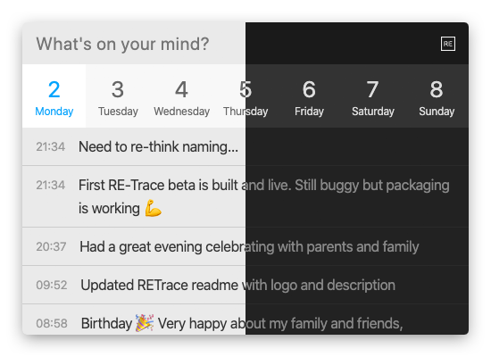

   
  

RE-Trace makes journaling fast while staying out of your way. No cluttered UI, no long click paths to create your new entry. Just hit the shortcut (<kbd>⌘ CMD</kbd>+<kbd>L</kbd> on Mac, <kbd>Ctrl</kbd>+<kbd>L</kbd> on Windows and Linux), enter what's on your mind, hit <kbd>Enter</kbd> and you're done.

In the evening, make sure to take a deep breath and recap your day.

## Installation

Grab the latest build from our [release page](https://github.com/Staffbase/retrace/releases).

## Development

1. Install dependencies `> yarn`
2. Start `yarn start`
